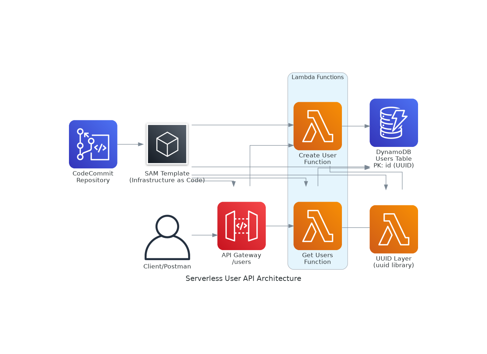

# Serverless User API

Một backend serverless API được xây dựng bằng AWS SAM (Serverless Application Model) để quản lý users với các chức năng tạo và lấy danh sách users.

## 🏗️ Kiến trúc



### Thành phần chính:

- **API Gateway**: REST API với endpoints POST /users và GET /users
- **Lambda Functions**: 
  - `createUser`: Tạo user mới với UUID
  - `getUsers`: Lấy danh sách tất cả users
- **Lambda Layer**: Chứa thư viện UUID
- **DynamoDB**: Lưu trữ user data với Primary Key là id (UUID)
- **SAM Template**: Infrastructure as Code
- **CodeCommit**: Source code repository

## 📋 Yêu cầu

- AWS CLI đã cài đặt và cấu hình
- SAM CLI đã cài đặt
- Node.js 18.x
- Git (để push lên CodeCommit)

## 🚀 Cài đặt và Triển khai

### 1. Clone repository

```bash
git clone <repository-url>
cd serverless-user-api
```

### 2. Cài đặt dependencies

```bash
# Cài đặt dependencies cho UUID layer
cd layers/uuid-layer/nodejs
npm install
cd ../../..

# Cài đặt dependencies cho Lambda functions
cd src/handlers
npm install
cd ../..
```

### 3. Build và Deploy

```bash
# Sử dụng script tự động
./deploy.sh

# Hoặc thực hiện thủ công
sam build
sam deploy --guided
```

### 4. Test API

```bash
# Sử dụng script test tự động
./test-api.sh

# Hoặc test thủ công với curl
curl -X POST <API_URL>/users -H 'Content-Type: application/json' -d '{"name":"John Doe"}'
curl -X GET <API_URL>/users
```

## 📡 API Endpoints

### POST /users
Tạo một user mới.

**Request Body:**
```json
{
  "name": "string (required)"
}
```

**Success Response (200):**
```json
{
  "statusCode": 200,
  "body": {
    "id": "uuid",
    "name": "string",
    "createdAt": "ISO 8601 timestamp"
  }
}
```

**Error Response (400):**
```json
{
  "statusCode": 400,
  "message": "Name is required and must be a non-empty string"
}
```

### GET /users
Lấy danh sách tất cả users.

**Success Response (200):**
```json
{
  "statusCode": 200,
  "body": [
    {
      "id": "uuid",
      "name": "string",
      "createdAt": "ISO 8601 timestamp"
    }
  ]
}
```

## 🗂️ Cấu trúc Project

```
serverless-user-api/
├── template.yaml                 # SAM template
├── samconfig.toml               # SAM configuration
├── deploy.sh                    # Deployment script
├── test-api.sh                  # API testing script
├── cleanup.sh                   # Cleanup script
├── README.md                    # Documentation
├── src/
│   └── handlers/
│       ├── createUser.js        # Create user Lambda function
│       ├── getUsers.js          # Get users Lambda function
│       └── package.json         # Dependencies for Lambda functions
└── layers/
    └── uuid-layer/
        └── nodejs/
            ├── package.json     # UUID library dependency
            └── node_modules/    # Installed dependencies
```

## 🔧 Cấu hình

### Environment Variables
- `USERS_TABLE`: Tên DynamoDB table (được set tự động)

### DynamoDB Table Schema
- **Table Name**: `{StackName}-users-{Stage}`
- **Primary Key**: `id` (String)
- **Attributes**:
  - `id`: UUID (Primary Key)
  - `name`: String
  - `createdAt`: ISO 8601 timestamp

### Lambda Layer
- **Name**: `uuid-layer`
- **Runtime**: Node.js 18.x
- **Library**: UUID v9.0.0

## 🧪 Testing

### Automated Testing
```bash
./test-api.sh
```

### Manual Testing với Postman

1. **Create User**
   - Method: POST
   - URL: `https://<api-id>.execute-api.us-east-1.amazonaws.com/dev/users`
   - Headers: `Content-Type: application/json`
   - Body: `{"name": "John Doe"}`

2. **Get Users**
   - Method: GET
   - URL: `https://<api-id>.execute-api.us-east-1.amazonaws.com/dev/users`

### Kiểm tra DynamoDB
```bash
aws dynamodb scan --table-name <table-name> --region us-east-1
```

## 🔗 CodeCommit Integration

### 1. Tạo CodeCommit Repository
```bash
aws codecommit create-repository --repository-name serverless-user-api --region us-east-1
```

### 2. Push code lên CodeCommit
```bash
git init
git add .
git commit -m "Initial commit"
git remote add origin https://git-codecommit.us-east-1.amazonaws.com/v1/repos/serverless-user-api
git push -u origin main
```

## 🌐 Custom Domain (Optional)

Để sử dụng custom domain, cập nhật parameter trong `samconfig.toml`:

```toml
parameter_overrides = "Stage=dev DomainName=api.yourdomain.com"
```

**Lưu ý**: Bạn cần có:
- Domain đã đăng ký trong Route53
- SSL certificate trong ACM

## 🧹 Cleanup

Để xóa tất cả resources:

```bash
./cleanup.sh
```

Hoặc:

```bash
sam delete --stack-name serverless-user-api --region us-east-1
```

## 🐛 Troubleshooting

### Build Errors
- Đảm bảo Node.js 18.x được cài đặt
- Chạy `npm install` trong các thư mục cần thiết

### Deployment Errors
- Kiểm tra AWS credentials
- Đảm bảo có quyền tạo CloudFormation stack
- Kiểm tra region settings

### API Errors
- Kiểm tra CloudWatch Logs cho Lambda functions
- Verify DynamoDB table permissions
- Check API Gateway configuration

## 📚 Tài liệu tham khảo

- [AWS SAM Documentation](https://docs.aws.amazon.com/serverless-application-model/)
- [AWS Lambda Documentation](https://docs.aws.amazon.com/lambda/)
- [Amazon DynamoDB Documentation](https://docs.aws.amazon.com/dynamodb/)
- [Amazon API Gateway Documentation](https://docs.aws.amazon.com/apigateway/)

## 📄 License

MIT License
